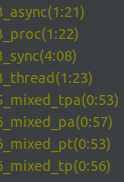

# Just bunch of code samples

## At the moment, all code in this repository is for study purposes only.

[old_dump.py](old_dump.py) - was made for one-time use in order to save some translations from the site due to its instability.

Other files contain the same code as in the [old_dump.py](old_dump.py), but written using async, multithreading and multiprocessing in various combinations.

Speed Comparison:

